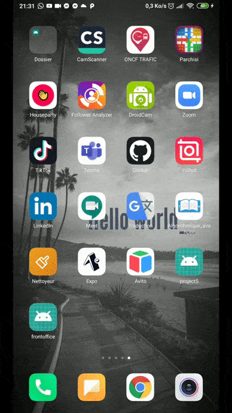

# AppGenerator


## Installation
The instructions are a bit different depending on your development operating system.
Follow these [instructions](https://reactnative.dev/docs/environment-setup)

## Run the application
#### Start Metro
```sh
npx react-native start
```

#### Start the application
Let Metro Bundler run in its own terminal. Open a new terminal inside your React Native project folder. Run the following:


```sh
npx react-native run-android
```

##### for more visibility you can follow these [Instructions](https://reactnative.dev/docs/environment-setup)
